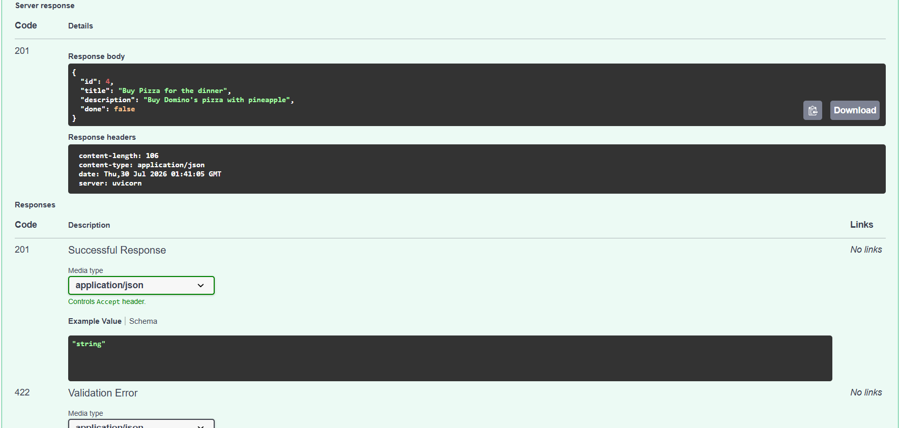

# Todo API

A simple CRUD API for managing tasks, built with FastAPI as part of the FlyRank AI Backend Internship, Week 2.

## Installation & Running

```bash
git clone https://github.com/Carb18/todo-api-fastapi.git
cd todo-api-fastapi
python -m venv venv
source venv/Scripts/activate  # Windows Git Bash
pip install -r requirements.txt
uvicorn main:app --reload
```

Then open http://localhost:8000/docs to see the interactive Swagger UI.

## Endpoints

| Method | Path         | Description         |
|--------|--------------|----------------------|
| GET    | /            | API info             |
| GET    | /health      | Health check         |
| GET    | /tasks       | List all tasks       |
| GET    | /tasks/{id}  | Get one task         |
| POST   | /tasks       | Create a new task    |
| PUT    | /tasks/{id}  | Update a task        |
| DELETE | /tasks/{id}  | Delete a task        |

## Example request

**Create a task:**
```bash
curl -i -X POST http://localhost:8000/tasks -H "Content-Type: application/json" -d "{\"title\":\"Test task\",\"description\":\"testing\"}"
```

**Response:**
HTTP/1.1 201 Created
date: Thu, 30 Jul 2026 02:20:00 GMT
server: uvicorn
content-length: 65
content-type: application/json

{"id":4,"title":"Test task","description":"testing","done":false}

## Swagger UI

